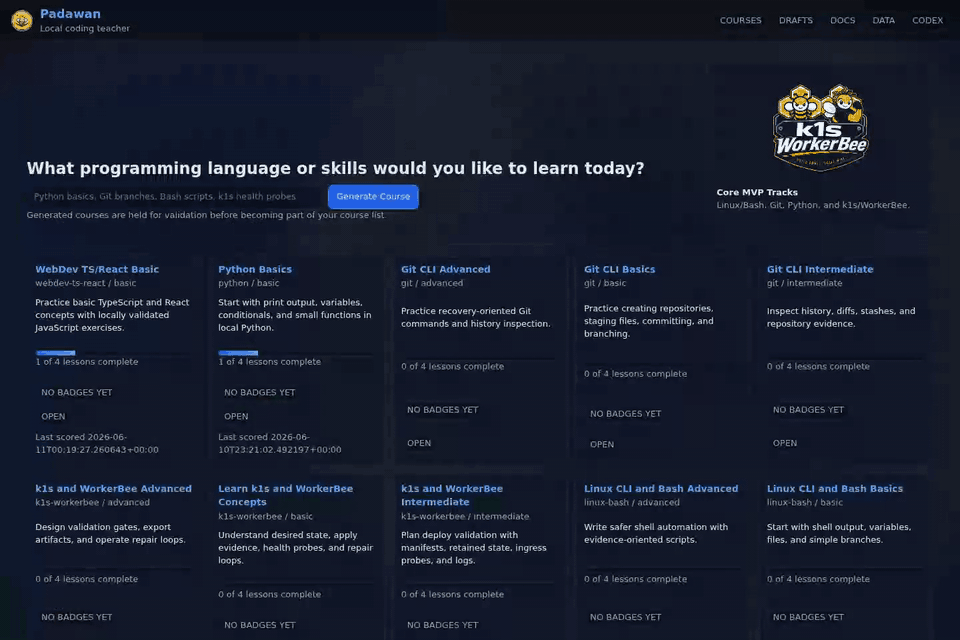

# Padawan

<p align="center">
  
</p>

Padawan is a local progressive coding teacher. It serves a web UI on your
machine, stores learner progress locally, runs exercises in temporary
workspaces, and uses your existing Codex CLI login for generated explanations
and course drafts.

Padawan is meant to be approachable for newcomers while still being useful to
developers who want local validation, draft review, and WorkerBee deployment
checks.

## What You Can Do

- Pick a topic such as Python, Git, Bash, React, HTMX, k1s, WorkerBee, Roblox,
  Unity, or Unreal.
- Work through lessons with teaching material on the left and code/runtime
  feedback on the right.
- Reveal a hint when stuck.
- Ask Codex for an explanation when the Codex CLI is installed and signed in.
- Track course progress and local badges.
- Back up and restore local learner data.
- Review generated course drafts before they become visible courses.

## Quickstart

Run these commands from the repository root.

```bash
python -m venv .venv
. .venv/bin/activate
python -m pip install -e .[dev]
padawan doctor
padawan serve
```

Open `http://127.0.0.1:8787/`.

Start with the bundled courses if you are new. They do not require Codex.
Generated courses and interactive explanations require the Codex CLI.

## Local Docs

The web app includes the same user docs at `/docs`. Recommended reading order:

1. First Steps
2. Install Padawan
3. Runtime Safety
4. Data Backup And Restore
5. Codex Integration
6. Course Authoring
7. WorkerBee Validation
8. Troubleshooting

## Codex

Padawan calls the installed `codex` CLI. It does not read or store Codex auth files.
Run this once if Codex is not already signed in:

```bash
codex login
```

Generated explanations can be continued in the lesson dialog when the Codex CLI returns a
thread id. Generated courses are saved as drafts until local validation passes.

Codex is optional. If it is not installed, normal course browsing, local lessons,
progress, badges, docs, and backup/restore still work.

## Checks

```bash
ruff format --check
ruff check
pytest
padawan course validate --course all-seed
padawan course draft list
padawan data export --output /tmp/padawan-backup.zip
padawan data inspect /tmp/padawan-backup.zip
```

## Courses

The bundled catalog covers basic, intermediate, and advanced checkpoints for Linux/Bash,
Git, Python, WebDev TS/React, WebDev Python/HTMX, k1s/WorkerBee, Roblox, Unity, and
Unreal. Python, Bash, Git, Node, and text-answer lessons validate locally. Roblox, Unity,
and Unreal lessons use text validation until engine-specific adapters are added.

## Data

Use the `/data` page or `padawan data` commands to back up and restore local
progress, badges, generated drafts, and local courses. Restore uses a safe merge
and creates a pre-restore backup before writing.

## WorkerBee

WorkerBee is optional for novice seed-course use, but it is the validation workbench for
publishable generated courses and deployable app checks.

The current WorkerBee manifest lives at `ops/workerbee/padawan.k1s.yaml`.

## License

Padawan is released under the Apache License 2.0. See [LICENSE](LICENSE).
